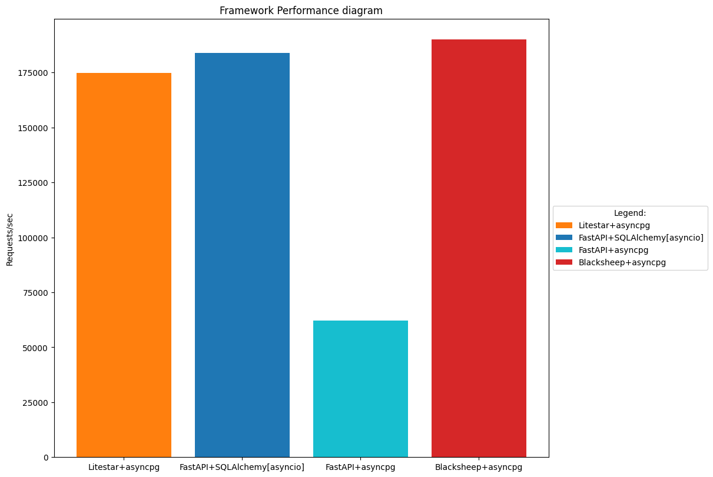

# Testing Frameworks

### Here are the examples of using web frameworks that are closest to real tasks.

Testing was carried out using [wrk](https://github.com/wg/wrk).

Before the tests, you should run the command, first substituting the user ID instead of "user_id":

```shell
export USER_ID=user_id
```

1. [BlackSheep](https://github.com/Neoteroi/BlackSheep) is an asynchronous web framework to build event based web
   applications with Python.

   <span style="color: #FF7276" >Input:<span/>

   ```shell
   wrk -d15s -t4 -c64 --latency "http://localhost:8001/user?user_id=${USER_ID}"
   ```

   <span style="color: #FF7276" >Output:<span/>

   ```text
   Running 15s test @ http://localhost:8001/user?user_id=23821d87-373f-4050-9ac2-fd4e0bc9a56e
     4 threads and 64 connections
     Thread Stats   Avg      Stdev     Max   +/- Stdev
       Latency     5.09ms    1.21ms  50.52ms   93.59%
       Req/Sec     3.18k   154.40     4.07k    84.17%
     Latency Distribution
        50%    5.04ms
        75%    5.47ms
        90%    5.79ms
        99%    7.29ms
     190015 requests in 15.04s, 55.45MB read
   Requests/sec:  12636.34
   Transfer/sec:      3.69MB
   ```
2. [Litestar](https://github.com/litestar-org/litestar) is a powerful, performant, flexible and opinionated ASGI
   framework, offering first class typing support and a full Pydantic integration.

   <span style="color: #FF7276" >Input:<span/>

   ```shell
   wrk -d15s -t4 -c64 --latency "http://localhost:8002/user/${USER_ID}"
   ```

   <span style="color: #FF7276" >Output:<span/>

   ```text
   Running 15s test @ http://localhost:8002/user/23821d87-373f-4050-9ac2-fd4e0bc9a56e
     4 threads and 64 connections
     Thread Stats   Avg      Stdev     Max   +/- Stdev
       Latency     5.54ms    2.35ms  28.54ms   68.64%
       Req/Sec     2.92k   354.96     4.33k    71.10%
     Latency Distribution
        50%    5.05ms
        75%    7.26ms
        90%    8.89ms
        99%   10.79ms
     174812 requests in 15.10s, 51.01MB read
   Requests/sec:  11576.97
   Transfer/sec:      3.38MB
   ```
3. [FastAPI](https://github.com/tiangolo/fastapi) is a modern, fast (high-performance), web framework for building APIs
   with Python 3.7+ based on standard Python type hints.

   <span style="color: #FF7276" >Input:<span/>

   ```shell
   wrk -d15s -t4 -c64 --latency "http://localhost:8000/api/user/${USER_ID}"
   ```

   <span style="color: #FF7276" >Output:<span/>

   ```text
   Running 15s test @ http://localhost:8000/api/user/ab97c816-7f0d-41de-9006-ec4803fc8e66
     4 threads and 64 connections
     Thread Stats   Avg      Stdev     Max   +/- Stdev
       Latency     7.24ms    6.91ms 193.37ms   99.16%
       Req/Sec     2.34k   128.76     3.04k    91.50%
     Latency Distribution
        50%    6.73ms
        75%    7.48ms
        90%    7.98ms
        99%   11.10ms
     139999 requests in 15.03s, 41.52MB read
   Requests/sec:   9312.01
   Transfer/sec:      2.76MB
   ```

   

## Docs

* BlackSheep: [Swagger](http://localhost:8001/docs#/)
* Litestar: [Swagger](http://localhost:8002/schema/swagger#/), [ReDoc](http://localhost:8002/schema/redoc#/)
* FastAPI: [Swagger](http://localhost:8000/api/openapi#/)
