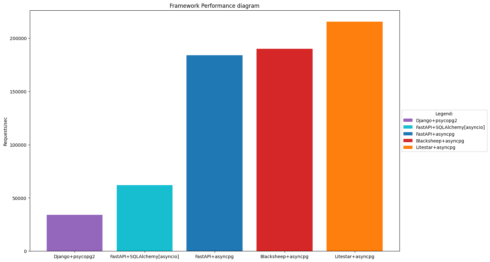

# Testing Frameworks

### Here are the examples of using web frameworks that are closest to real tasks.

Testing was carried out using [wrk](https://github.com/wg/wrk).

Before the tests, you should run the command, first substituting the user ID instead of "user_id":

```shell
export USER_ID=user_id
```

1. [BlackSheep](https://github.com/Neoteroi/BlackSheep) is an asynchronous web framework to build event based web
   applications with Python.

   <span style="color: #FF7276" >Input:<span/>

   ```shell
   wrk -d15s -t4 -c64 --latency "http://localhost:8001/user?user_id=${USER_ID}"
   ```

   <span style="color: #FF7276" >Output:<span/>

   ```text
   Running 15s test @ http://localhost:8001/user?user_id=23821d87-373f-4050-9ac2-fd4e0bc9a56e
     4 threads and 64 connections
     Thread Stats   Avg      Stdev     Max   +/- Stdev
       Latency     5.09ms    1.21ms  50.52ms   93.59%
       Req/Sec     3.18k   154.40     4.07k    84.17%
     Latency Distribution
        50%    5.04ms
        75%    5.47ms
        90%    5.79ms
        99%    7.29ms
     190015 requests in 15.04s, 55.45MB read
   Requests/sec:  12636.34
   Transfer/sec:      3.69MB
   ```
2. [Litestar](https://github.com/litestar-org/litestar) is a powerful, performant, flexible and opinionated ASGI
   framework, offering first class typing support and a full Pydantic integration.

   <span style="color: #FF7276" >Input:<span/>

   ```shell
   wrk -d15s -t4 -c64 --latency "http://localhost:8002/user/${USER_ID}"
   ```

   <span style="color: #FF7276" >Output:<span/>

   ```text
   Running 15s test @ http://localhost:8002/user/58a18e7c-7e38-4479-919b-3b4e9c5bd099
      4 threads and 64 connections
      Thread Stats   Avg      Stdev     Max   +/- Stdev
        Latency     4.50ms    1.43ms  19.92ms   79.23%
        Req/Sec     3.60k   316.58     5.86k    73.42%
      Latency Distribution
         50%    3.99ms
         75%    5.30ms
         90%    6.43ms
         99%    7.79ms
      215443 requests in 15.10s, 63.08MB read
    Requests/sec:  14267.61
    Transfer/sec:      4.18MB
   ```
3. [FastAPI](https://github.com/tiangolo/fastapi) is a modern, fast (high-performance), web framework for building APIs
   with Python 3.7+ based on standard Python type hints.

   #### <span style="color: #23CC20" >Using asyncpg:<span/>

   <span style="color: #FF7276" >Input:<span/>

   ```shell
   wrk -d15s -t4 -c64 --latency "http://localhost:8000/api/user/${USER_ID}"
   ```

   <span style="color: #FF7276" >Output:<span/>

   ```text
   Running 15s test @ http://localhost:8000/api/user/7f219465-1685-4ea6-9293-a061ff78f62b
     4 threads and 64 connections
     Thread Stats   Avg      Stdev     Max   +/- Stdev
       Latency     5.49ms    4.33ms 160.75ms   98.20%
       Req/Sec     3.08k   363.87     9.56k    93.68%
     Latency Distribution
        50%    5.22ms
        75%    5.90ms
        90%    6.35ms
        99%   15.32ms
     183932 requests in 15.10s, 53.50MB read
   Requests/sec:  12181.38
   Transfer/sec:      3.54MB
   ```
   #### <span style="color: #23CC20" >Using sqlalchemy[asyncio]:<span/>

   <span style="color: #FF7276" >Input:<span/>

   ```shell
   wrk -d15s -t4 -c64 --latency "http://localhost:8000/api/user/orm/${USER_ID}"
   ```

   <span style="color: #FF7276" >Output:<span/>
   ```text
   Running 15s test @ http://localhost:8000/api/user/orm/7f219465-1685-4ea6-9293-a061ff78f62b
     4 threads and 64 connections
     Thread Stats   Avg      Stdev     Max   +/- Stdev
       Latency    15.74ms    7.84ms 113.81ms   64.42%
       Req/Sec     1.04k   192.81     1.65k    70.50%
     Latency Distribution
        50%   15.20ms
        75%   20.55ms
        90%   25.11ms
        99%   42.05ms
     62126 requests in 15.04s, 18.07MB read
   Requests/sec:   4130.57
   Transfer/sec:      1.20MB
   ```
4. [Django](https://github.com/django/django) is a high-level Python web framework that encourages rapid development
   and clean, pragmatic design.

   <span style="color: #FF7276" >Input:<span/>

   ```shell
   wrk -d15s -t4 -c64 --latency "http://localhost:8003/api/user/${USER_UUID}"
   ```
   
   <span style="color: #FF7276" >Output:<span/>

   ```text
   Running 15s test @ http://localhost:8003/api/user/3176a565-5f6b-4903-8c58-a6694235392b
     4 threads and 64 connections
     Thread Stats   Avg      Stdev     Max   +/- Stdev
       Latency    27.94ms    2.60ms  56.47ms   92.58%
       Req/Sec   572.39     47.68   646.00     68.00%
     Latency Distribution
        50%   27.30ms
        75%   28.10ms
        90%   29.43ms
        99%   38.89ms
     34193 requests in 15.04s, 15.23MB read
     Socket errors: connect 0, read 34192, write 0, timeout 0
   Requests/sec:   2273.69
   Transfer/sec:      1.01MB
   ```
   
   

## Docs

* BlackSheep: [Swagger](http://localhost:8001/docs#/)
* Litestar: [Swagger](http://localhost:8002/schema/swagger#/), [ReDoc](http://localhost:8002/schema/redoc#/)
* FastAPI: [Swagger](http://localhost:8000/api/openapi#/)
* Django: [Swagger](http://localhost/api/docs/#/), [Admin](http://localhost/admin/)
